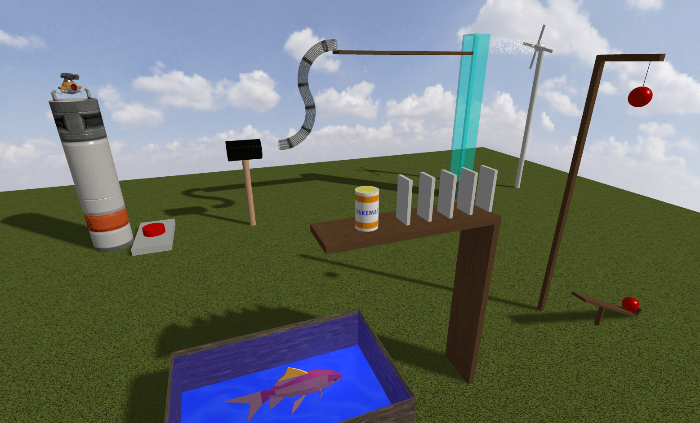

# RB Machine (Rube Goldberg Machine)

A 3D physics simulation built with Three.js where you trigger a chain reaction to feed a fish. It's basically a virtual Rube Goldberg machine with physics, lighting, and sound effects.

## 🚀 [Live Demo](https://fish-feed-rb-machine.vercel.app)



## 🎯 Features

- **3D Physics**: Physics simulation powered by Ammo.js
- **Chain Reaction**: Each component triggers the next one in sequence  
- **Multiple Cameras**: Six different viewpoints that switch automatically
- **Sound Effects**: Audio synchronized with the physics interactions
- **Modular Design**: Scene-based architecture with reusable components
- **Nice Materials**: PBR textures with normal maps and lighting
- **Particle Effects**: Water shaders and visual effects

## 🎮 How to Play

1. **Goal**: Feed the fish by starting the elevator
2. **Controls**: 
   - Click "Go to the elevator" to start
   - Use mouse to look around
   - Watch everything happen automatically
3. **That's it**: Just sit back and watch the chain reaction

## 🚀 Quick Start

### Prerequisites
- Node.js (v14 or higher)
- npm or yarn

### Installation

```bash
# Clone the repository
git clone https://github.com/madeleinewoodbury/rb-machine
cd rb-machine

# Install dependencies
npm install

# Start development server
npm run dev
```

The application will automatically open in your browser at `http://localhost:5173`.

### Build for Production

```bash
npm run build
```

## 🏗️ Technical Architecture

### Core System
- **Environment.js**: Main orchestrator managing the simulation lifecycle
- **RenderInfo.js**: Handles rendering, cameras, and visual scene management  
- **PhysicsInfo.js**: Manages Ammo.js physics world and collision detection
- **AmmoHelper.js**: Utility class for creating physics bodies and shapes

### Scene Components
The machine consists of nine interconnected scenes:

1. **World Scene**: Environment setup with skybox and lighting
2. **Elevator Scene**: Interactive starting mechanism
3. **Wind Scene**: Fan system affecting particle movement
4. **Tube Scene**: Ball transport system
5. **Hammer Scene**: Mechanical hammer trigger
6. **Laser Gun Scene**: Precision targeting system
7. **Balancing Board Scene**: Pivoting balance mechanism
8. **Pillar Scene**: Domino sequence
9. **Fish Scene**: Final aquarium with feeding mechanism

### Physics System
- **Collision Groups**: Organized collision detection for different object types
- **Rigid Bodies**: Each interactive element has proper physics properties
- **Chain Reactions**: Collision callbacks trigger sequential events

## 📁 Project Structure

```
rb-machine/
├── src/
│   ├── index.html              # Main HTML with embedded shaders
│   ├── style.css               # Global styles
│   └── js/
│       ├── app.js              # Entry point and initialization
│       ├── Environment.js      # Main simulation controller
│       ├── RenderInfo.js       # Rendering and camera management
│       ├── PhysicsInfo.js      # Physics world management
│       ├── AmmoHelper.js       # Physics utilities
│       ├── scenes/             # Modular scene compositions
│       ├── sceneObjects/       # Interactive object classes
│       ├── lights/             # Lighting system
│       └── utils/              # Shared utilities
├── static/
│   ├── models/                 # 3D models (.glb files)
│   ├── textures/               # PBR texture sets
│   ├── sounds/                 # Audio effects
│   └── lib/                    # External libraries (Ammo.js)
└── vite.config.js              # Build configuration
```

## 🛠️ Technologies Used

- **Three.js** (v0.158.0) - 3D graphics and rendering
- **Ammo.js** - Physics simulation (Bullet Physics port)
- **Vite** - Fast build tool and development server
- **Tween.js** - Smooth animations
- **lil-gui** - Debug interface
- **Stats.js** - Performance monitoring

### Additional Features
- **PBR Materials**: Physically based rendering with normal maps, roughness, and ambient occlusion
- **Shader Materials**: Custom water effects and particle systems
- **Audio Integration**: Spatial audio synchronized with physics events
- **Camera System**: Automatic cinematography with smooth transitions

## 🎨 Assets

### Textures
- **Materials**: Metal, wood, stone, sci-fi surfaces with full PBR maps from [Polyhaven](https://polyhaven.com/) and [3dtextures.me](https://3dtextures.me/)
- **Particles**: 13 different particle textures for effects
- **Environment**: Skybox cubemap

### Audio
- **Sound Effects**: 9 audio files from [Pixabay](https://pixabay.com/)
- **Spatial Audio**: 3D positioned audio sources

### 3D Models
- **Goldfish**: Animated fish model from [Poly Pizza](https://poly.pizza/)
- **Laser Gun**: Interactive weapon model from [Poly Pizza](https://poly.pizza/)

## 🔧 Development

### Available Scripts

```bash
npm run dev     # Start development server with hot reload
npm run build   # Build production version to dist/
```

### Development Notes
- Physics runs at 60 FPS with proper deltaTime calculations
- Reset mechanism uses localStorage for state persistence
- All materials use consistent PBR workflow
- Collision detection drives the chain reaction sequence

## 🤝 Contributing

1. Fork the repository
2. Create a feature branch (`git checkout -b feature/amazing-feature`)
3. Commit your changes (`git commit -m 'Add amazing feature'`)
4. Push to the branch (`git push origin feature/amazing-feature`)
5. Open a Pull Request

### Development Guidelines
- Follow the existing modular scene architecture
- Use AmmoHelper for consistent physics body creation
- Maintain PBR material standards for new textures
- Add appropriate sound effects for new interactive elements

## 📄 License

This project is licensed under the ISC License - see the LICENSE file for details.

## 🙏 Acknowledgments

- Built with Three.js and the WebGL community
- Physics powered by Bullet Physics via Ammo.js
- Textures from [Polyhaven](https://polyhaven.com/) (CC0) and [3dtextures.me](https://3dtextures.me/) (CC0)
- 3D Models from [Poly Pizza](https://poly.pizza/) (CC0)
- Sound effects from [Pixabay](https://pixabay.com/) (CC0)

---

*A simple goal: feed the fish. Not-so-simple method: elaborate chain reaction machine.*